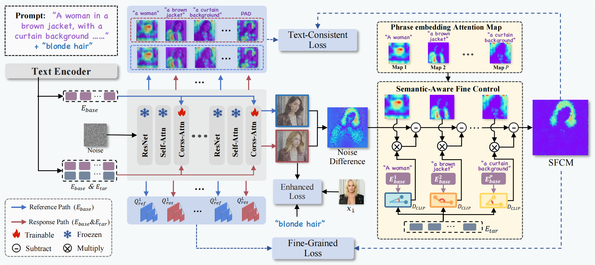
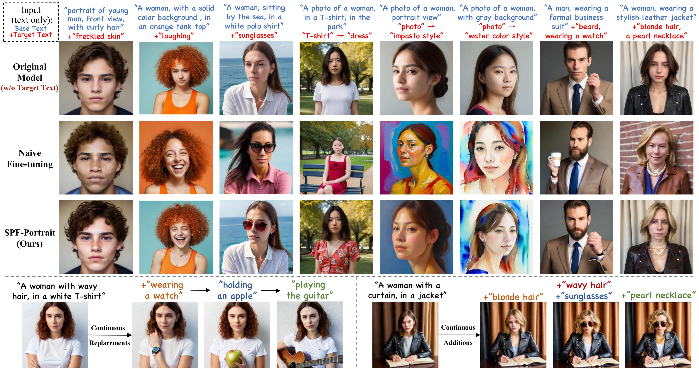

<div align="center">
<h1>SPF-Portrait: Towards Pure Portrait Customization with Semantic Pollution-Free Fine-tuning</h1>

[**Xiaole Xian**](https://scholar.google.com/citations?user=XpaHZywAAAAJ&hl=zh-CN)<sup>1 * </sup>· [**Zhichao Liao**](https://scholar.google.com.hk/citations?user=4eRwbOEAAAAJ&hl=zh-CN)<sup>2 *</sup> · [**Qingyu Li**](https://github.com/wangqixun)<sup>3</sup> · [**Wenyu Qin**](https://huggingface.co/baymin0220)<sup>3</sup> · [**Pengfei Wan**](https://github.com/aihao2000)<sup>3</sup> · [**Weicheng Xie**](https://github.com/DannHuang)<sup>1✉</sup> · [**Long Zeng**](https://zechao-li.github.io/)<sup>2 ✉</sup> · [**Linlin Shen**](https://github.com/DannHuang)<sup>1</sup> · [**Pingfa Feng**](https://github.com/DannHuang)<sup>2</sup>

<sup>1</sup>Shenzhen University · <sup>2</sup>Tsinghua University · <sup>3</sup>Kuaishou Technology

<sup>*</sup>equal contributions · <sup>♰</sup> Internship at KwaiVGI, Kuaishou Technology · <sup>✉</sup>corresponding authors 

<a href='https://tgre3w2.github.io/SPF-Protrait//'></a>  <a href='https://arxiv.org/abs/2503.23907'></a>  [](https://huggingface.co/)  [](https://huggingface.co/)  [](https://github.com/SPF-Portrait/SPF-Portrait)
</div>
  
##  🔥 Updates 

- [x] **`2025/04/02`**: 🔥 We released the technical report on [arXiv](https://arxiv.org/pdf/2504.00396).

##   💪 Plan 

- [x] Technical report
- [ ] Inference code
- [ ] Pre-trained weight for inference [SDv1.5]
- [ ] Training code

（Thanks for your attention! The checkpoints and codes are coming soon!）

## 📖 Abstract 

While fine-tuning pre-trained Text-to-Image (T2I) models on portrait datasets enables attribute customization, existing methods suffer from Semantic Pollution that compromises the original model's behavior and prevents incremental learning. To address this, we propose SPF-Portrait, a pioneering work to purely understand customized semantics while eliminating semantic pollution in text-driven portrait customization. In our SPF-Portrait, we propose a dual-path pipeline that introduces the original model as a reference for the conventional fine-tuning path. Through contrastive learning, we ensure adaptation to target attributes and purposefully align other unrelated attributes with the original portrait. We introduce a novel Semantic-Aware Fine Control Map, which represents the precise response regions of the target semantics, to spatially guide the alignment process between the contrastive paths. This alignment process not only effectively preserves the performance of the original model but also avoids over-alignment. Furthermore, we propose a novel response enhancement mechanism to reinforce the performance of target attributes, while mitigating representation discrepancy inherent in direct cross-modal supervision. Extensive experiments demonstrate that SPF-Portrait achieves state-of-the-art performance.

## 💻 Pipeline

<p align="center">
  
</p>

## 🚅 Capabilities 

  🔥 Our SPF-Portrait achieves **human attributes adaption of T2I model without pollution of the original capability**.

  🔥 For more results, visit our <a href="https://csgo-gen.github.io"><strong>homepage</strong></a>

<p align="center">
  
</p>

## 💖 Citation

If you find SPF-Portrait useful for your research, welcome to 🌟 this repo and cite our work using the following BibTeX:

```bibtex
@article{xian2024spf,
       title={SPF-Portrait: Towards Pure Portrait Customization with Semantic Pollution-Free Fine-tuning}, 
       author={Xiaole Xian and Zhichao Liao and Qingyu Li and Wenyu Qin and Pengfei Wan and Weicheng Xie, Long Zeng and Linlin Shen and Pingfa Feng},
       year={2025},
       journal = {arXiv 2504.00396},
}
```
