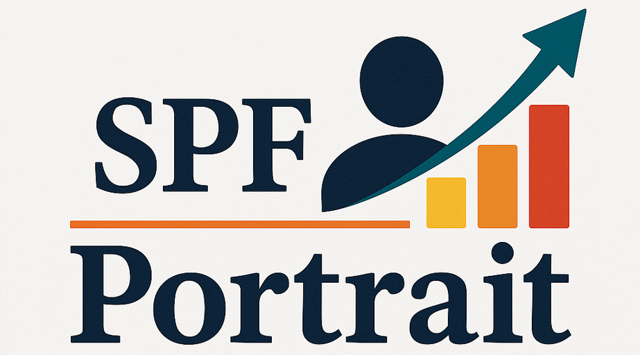

<div align="center">  </img>  </div>

<div align="center">
<h1>SPF-Portrait: Towards Pure Portrait Customization with Semantic Pollution-Free Fine-tuning</h1>

[**Xiaole Xian**](https://scholar.google.com/citations?user=XpaHZywAAAAJ&hl=zh-CN)<sup> * ♰ 1</sup> · [**Zhichao Liao**](https://lzc-sg.github.io/)<sup>* ♰ 2</sup> · [Qingyu Li]()<sup>3</sup> · [Wenyu Qin]()<sup>3</sup> · [Pengfei Wan]()<sup>3</sup> · [Weicheng Xie]()<sup>1✉</sup> · [Long Zeng]()<sup>2 ✉</sup> · [Linlin Shen]()<sup>1</sup> · [Pingfa Feng]()<sup>2</sup>

<sup>1</sup>Shenzhen University · <sup>2</sup>Tsinghua University · <sup>3</sup>Kuaishou Technology

<sup>*</sup>Equal contributions · <sup>♰</sup> Internship at KwaiVGI, Kuaishou Technology · <sup>✉</sup>Corresponding authors 

<a href='https://spf-portrait.github.io/SPF-Portrait/'></a>  &nbsp; 
<a href='https://arxiv.org/abs/2504.00396'></a>  &nbsp; 
<a href="https://github.com/KwaiVGI/SPF-Portrait"></a> &nbsp; 
<br>
[](https://huggingface.co/)  &nbsp; 
[](https://huggingface.co/)  &nbsp; 
[](https://github.com/KwaiVGI/SPF-Portrait) &nbsp; 
</div>
  
##  🔥 Updates 

- [x] **`2025/04/02`**: 🔥 We released the technical report on [arXiv](https://arxiv.org/pdf/2504.00396).

##   💪 Plan 

- [x] Technical report
- [ ] Inference code
- [ ] Pre-trained weight for inference [SDv1.5] in Huggingface Model🤗
- [ ] Demo deployment in Huggingface Space🤗
- [ ] Training code

（Thanks for your attention! The checkpoints and codes are coming soon!）

## 📖 Abstract 
Fine-tuning a pre-trained Text-to-Image (T2I) model on a tailored portrait dataset is the mainstream method for text-driven customization of portrait attributes.
Due to Semantic Pollution during fine-tuning, existing methods struggle to maintain the original model's behavior and achieve incremental learning while customizing target attributes.
To address this issue, we propose SPF-Portrait, a pioneering work to purely understand customized semantics while eliminating semantic pollution in text-driven portrait customization. 
In our SPF-Portrait, we propose a dual-path pipeline that introduces the original model as a reference for the conventional fine-tuning path.
Through contrastive learning, we ensure adaptation to target attributes and purposefully align other unrelated attributes with the original portrait.
We introduce a novel Semantic-Aware Fine Control Map, which represents the precise response regions of the target semantics, to spatially guide the alignment process between the contrastive paths.
This alignment process not only effectively preserves the performance of the original model but also avoids over-alignment.
Furthermore, we propose a novel response enhancement mechanism to reinforce the performance of target attributes, while mitigating representation discrepancy inherent in direct cross-modal supervision.
Extensive experiments demonstrate that SPF-Portrait achieves state-of-the-art performance.


## 💻 Pipeline

<p align="center">
  
</p>

## 🚅 Capabilities 

  🔥 Our SPF-Portrait achieves **human attributes adaption of T2I model without pollution of the original capability**.

  🔥 For more results, visit our <a href="https://spf-portrait.github.io/SPF-Portrait/"><strong>homepage</strong></a>

<p align="center">
  
</p>

## 💖 Citation

If you find SPF-Portrait useful for your research, welcome to 🌟 this repo and cite our work using the following BibTeX:

```bibtex
@article{xian2025spf,
  title={SPF-Portrait: Towards Pure Portrait Customization with Semantic Pollution-Free Fine-tuning},
  author={Xian, Xiaole and Liao, Zhichao and Li, Qingyu and Qin, Wenyu and Wan, Pengfei and Xie, Weicheng and Zeng, Long and Shen, Linlin and Feng, Pingfa},
  journal={arXiv preprint arXiv:2504.00396},
  year={2025}
}
```
